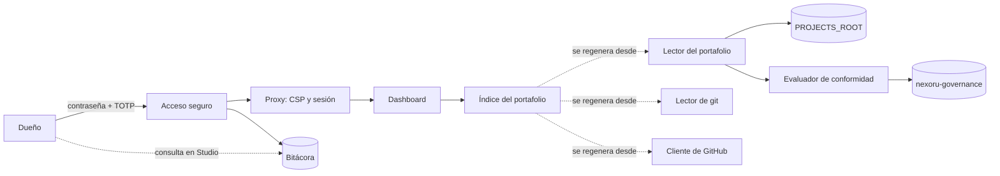

# Nexoru Op: mapa de diseño funcional

> Resumen visual y funcional del sistema. El estado de avance vive en el roadmap de [PROJECT.md](../PROJECT.md); el detalle técnico exacto (requisitos, criterios de aceptación, tareas) en `specs/`. Si algo aquí no coincide con `specs/`, **`specs/` es la fuente de verdad**, salvo que el código y la documentación técnica coincidan entre sí y la spec sea la que quedó desactualizada.
>
> Este documento no lleva estados de avance (porcentajes, "completa", "pendiente", fechas objetivo).

## 1. Misión

Mostrar al Dueño, en un solo lugar y sin captura manual, el estado real de todos los proyectos de Nexoru.

Es un **sistema de información local, de solo lectura y para un solo usuario**: lee los archivos de cada proyecto, su historial de git y, en solo lectura, GitHub, y los interpreta según el Estándar de Proyecto Nexoru. No envía nada ni escribe en ningún proyecto.

## 2. Componentes

| Componente | Función | Autonomía / responsable |
|---|---|---|
| Acceso seguro | Inicio de sesión del Dueño con contraseña y TOTP obligatorio, bloqueo por intentos, sesiones con inactividad (30 min) y duración máxima (12 h), códigos de recuperación | Automático; lo decide la base de datos (RLS que exige AAL2) |
| Proxy (`proxy.ts`) | CSP con nonce por petición, refresco de sesión, redirección según el nivel de autenticación y comprobación de la sesión en cada petición | Automático |
| Bitácora | Registro de solo inserción de accesos, intentos fallidos, bloqueos y acciones sobre la cuenta; el Dueño la consulta con SQL de solo lectura en Supabase Studio del entorno de uso | Automático; nadie puede modificarla |
| Lector del portafolio | Lee, dentro de `PROJECTS_ROOT`, solo los archivos que define el estándar (`PROJECT.md`, `docs/mapa-funcional.md`, `specs/`, `.specify/`) | Solo lectura; nunca lee `.env*` ni secretos |
| Evaluador de conformidad | Calcula el nivel de conformidad (0 a 3) de cada proyecto con las reglas de `nexoru-governance` y avisa de versiones del estándar no soportadas | Automático; aplica las reglas del estándar sin interpretarlas |
| Lector de git | Obtiene fechas y autores con comandos de git de solo lectura, sin shell y con argumentos fijos | Solo lectura |
| Cliente de GitHub | Consulta CI, visibilidad y PRs de cada repo | Solo lectura; token opcional |
| Índice del portafolio | Caché en la base de datos de lo leído, para mostrarlo rápido | Regenerable: se puede borrar y reconstruir sin pérdida |
| Scripts de terminal | `bootstrap:owner` (enlace de activación), `op:start` / `op:stop` (entorno de uso) | Los ejecuta el Dueño en la terminal integrada de VS Code |

## 3. Flujo

## 4. Reglas de negocio no negociables

- **Solo lectura:** el sistema no envía correos, mensajes ni notificaciones, y nunca escribe en los proyectos, en git ni en GitHub.
- **Fuente de verdad:** el estado del portafolio sale siempre de los archivos de cada proyecto, de git y de GitHub. La base de datos solo guarda autenticación, bitácora e índice regenerable. Un dato que falta se muestra como ausente; nunca se inventa.
- **Lector seguro:** solo rutas dentro de `PROJECTS_ROOT` (resolviendo rutas reales), solo los archivos del estándar, nunca `.env*` ni secretos, y sin ejecutar nada de los proyectos salvo comandos de git de solo lectura.
- **Estándar:** las reglas de conformidad se toman de `nexoru-governance`; un proyecto con una versión del estándar no soportada se señala en lugar de evaluarse con reglas que no le corresponden.
- **Seguridad:** un solo usuario, el Dueño; segundo factor obligatorio; la app, la base de datos y Supabase Studio escuchan solo en `127.0.0.1`; ningún secreto en el repo ni en la base de datos.
- **Entornos separados:** las pruebas corren contra una instancia distinta y no pueden tocar los datos de uso del Dueño.

## 5. Datos y fuentes

| Dato | Fuente | Disponibilidad | Confianza y regla |
|---|---|---|---|
| Manifiesto del proyecto (fase, estado, fechas, costos) | Frontmatter de `PROJECT.md` | Si el proyecto tiene `PROJECT.md` | Alta: es la decisión del Dueño. Si falta o no se puede parsear, el proyecto queda en nivel 0 |
| Estado de cada fase del roadmap | `tasks.md` de las specs vinculadas | Si las specs tienen `tasks.md` | Alta: se deriva contando casillas, según `standard/roadmap.md`. Sin `tasks.md`, se usa el estado manual |
| Nivel de conformidad | Reglas de `nexoru-governance/standard/conformance.md` aplicadas a los archivos | Siempre | Alta si la versión del estándar está soportada; si no, se avisa y no se evalúa |
| Fechas y autores | git (`log`, solo lectura) | Si la carpeta es un repo git | Alta |
| CI, visibilidad y PRs | API de GitHub | Con red; con o sin token | Alta cuando responde; si no responde, el dato se muestra como ausente |
| Versión del estándar | `nexoru-governance` (`CHANGELOG.md` y `version_estandar`) | Si `nexoru-governance` está en `PROJECTS_ROOT` | Alta |
| Eventos de acceso | Bitácora en Supabase local | Siempre | Alta: de solo inserción |

## 6. Integraciones

| Servicio | Qué se consume | Variable de entorno | Límites y costo por uso |
|---|---|---|---|
| API de GitHub | Estado de la CI, visibilidad del repo y PRs (solo lectura) | `GITHUB_TOKEN` (opcional, de solo lectura, en `.env.local`) | 60 peticiones/hora sin token; 5.000/hora con token. Sin costo |
| Have I Been Pwned | Comprobación de contraseñas filtradas por k-anonymity (solo salen 5 caracteres del hash) | Ninguna | Sin costo |
| Supabase local | Postgres y Auth en Docker | `NEXT_PUBLIC_SUPABASE_URL`, `NEXT_PUBLIC_SUPABASE_PUBLISHABLE_KEY`, `SUPABASE_SECRET_KEY` | Sin costo; corre en la máquina del Dueño |
