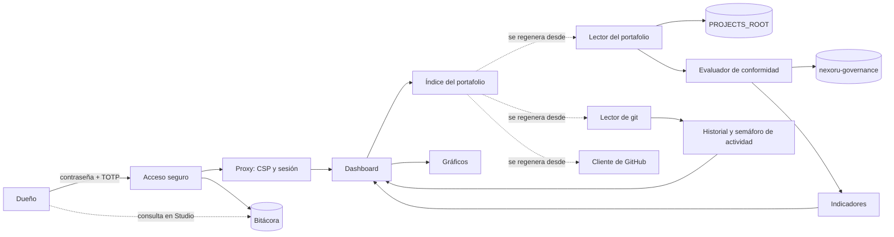

# Nexoru Op: mapa de diseño funcional

> Resumen visual y funcional del sistema. El estado de avance vive en el roadmap de [PROJECT.md](../PROJECT.md); el detalle técnico exacto (requisitos, criterios de aceptación, tareas) en `specs/`. Si algo aquí no coincide con `specs/`, **`specs/` es la fuente de verdad**, salvo que el código y la documentación técnica coincidan entre sí y la spec sea la que quedó desactualizada.
>
> Este documento no lleva estados de avance (porcentajes, "completa", "pendiente", fechas objetivo).

## 1. Misión

Mostrar al Dueño, en un solo lugar y sin captura manual, el estado real de todos los proyectos de Nexoru.

Es un **sistema de información local, de solo lectura y para un solo usuario**: lee los archivos de cada proyecto, su historial de git y, en solo lectura, GitHub, y los interpreta según el Estándar de Proyecto Nexoru. No envía nada ni escribe en ningún proyecto.

## 2. Componentes

| Componente | Función | Autonomía / responsable |
|---|---|---|
| Acceso seguro | Inicio de sesión del Dueño con contraseña y TOTP obligatorio, bloqueo por intentos, sesiones con inactividad (30 min) y duración máxima (12 h), códigos de recuperación | Automático; lo decide la base de datos (RLS que exige AAL2) |
| Proxy (`proxy.ts`) | CSP con nonce por petición, refresco de sesión, redirección según el nivel de autenticación y comprobación de la sesión en cada petición | Automático |
| Bitácora | Registro de solo inserción de accesos, intentos fallidos, bloqueos y acciones sobre la cuenta; el Dueño la consulta con SQL de solo lectura en Supabase Studio del entorno de uso | Automático; nadie puede modificarla |
| Lector del portafolio | Omite las carpetas listadas en `PROJECTS_ROOT/.nexoruignore` sin leerlas. Lee, dentro de `PROJECTS_ROOT`, solo los archivos que define el estándar (`PROJECT.md`, `docs/mapa-funcional.md`, `CLAUDE.md`, los `tasks.md` de `specs/` y los flujos de `.github/workflows/`) y comprueba la existencia de `.specify/`, specs, planes y `.env.example`. Muestra la copia en disco tal como está (rama actual) | Solo lectura; una sola puerta al disco con catálogo cerrado de rutas; nunca abre `.env*` ni llaves; archivos de hasta 1 MB |
| Evaluador de conformidad | Calcula el nivel de conformidad (0 a 3) de cada proyecto con las reglas de `nexoru-governance`, versionadas por versión del estándar (1.0, 1.1 y 1.2); evalúa 3.2 con la CI de GitHub y, en 1.2, la visibilidad declarada frente a la real; muestra el estado del roadmap (activo o concluido), los hallazgos de cierre de la 1.1, las fallas del siguiente nivel, advertencias, hallazgos y lo que no se puede evaluar sin GitHub (nivel 3 provisional). No evalúa proyectos con una versión no soportada o sin versión, y avisa si el estándar local es más nuevo | Automático; aplica las reglas del estándar sin interpretarlas |
| Lector de git | Obtiene la rama actual y la principal, si hay cambios sin commit, el remoto `origin`, los nombres de archivos `.env*` versionados y el historial: último commit, commits por semana de las últimas 12 semanas, adelanto y atraso contra `origin/HEAD` (o `main`), antigüedad de la referencia remota (fecha de `FETCH_HEAD`) y el commit que fijó la `fase` actual en `PROJECT.md`. Usa comandos de git de solo lectura, sin shell y con argumentos fijos | Solo lectura; con el prefijo endurecido no ejecuta programas configurados en el repo (`core.fsmonitor`, filtros, firmas, ganchos) ni reescribe su índice; si el repo tiene `.git/info/attributes`, los cambios sin commit quedan "no evaluados" |
| Historial y semáforo de actividad | Calcula los días sin actividad y su semáforo, la actividad semanal, los días en la fase y su comparación con `fase_desde` (coincide, no coincide, no verificable o contradice, con su explicación) | Automático; el semáforo es neutro en `pausado`, `operacion` y `retirado` |
| Indicadores | Conformidad (verificaciones cumplidas sobre las aplicables) y Avance (tareas hechas de las fases derivadas, cada spec una vez, sin las fases manuales), siempre con su base | Automático; ausentes, con el motivo, si el proyecto no se puede evaluar |
| Gráficos del portafolio | Cinco gráficos encima de la tabla (estado declarado, nivel de conformidad, avance por proyecto, fase del ciclo de vida y actividad de git por semana), cada uno con su tabla "Ver datos" | SVG generado en el servidor, sin JavaScript |
| Interfaz | Tablero y detalle de cada proyecto con la identidad visual de `nexoru-onboarding` (tema oscuro, tokens de diseño, Inter); semáforo declarado (círculo) y de actividad (cuadrado) con forma, ícono, texto y etiqueta | Sin estilos en línea (CSP); los textos con números concuerdan en singular y plural |
| Cliente de GitHub | Al pulsar Actualizar consulta, por prioridad, la visibilidad y la rama principal, la CI de esa rama (cada workflow), los PRs abiertos con su CI y el número de alertas de secretos abiertas de cada repo; guarda cada dato con su fecha y lo conserva si una consulta falla | Solo `GET` a `api.github.com`, catálogo cerrado de rutas, plazo de 8 s, sin reintentos; token opcional de solo lectura que nunca sale del servidor |
| Índice del portafolio | El resultado de la última lectura, en una fila de la base de datos; se vuelve a leer al abrir el dashboard si tiene más de 10 minutos o con el botón Actualizar | Regenerable: se puede borrar y reconstruir sin pérdida; solo lo lee y lo escribe el Dueño con segundo factor |
| Scripts de terminal | `op:start` / `op:stop` (entorno de uso), `op:bootstrap-owner` (enlace de activación), `op:fingerprint` (huella de solo lectura del entorno de uso) y `db:start` (instancia de pruebas); todos arrancan Supabase en una red de Docker solo en `127.0.0.1` | Los ejecuta el Dueño en la terminal integrada de VS Code; los de un entorno se niegan a tocar el otro |

## 3. Flujo

## 4. Reglas de negocio no negociables

- **Solo lectura:** el sistema no envía correos, mensajes ni notificaciones, y nunca escribe en los proyectos, en git ni en GitHub.
- **Fuente de verdad:** el estado del portafolio sale siempre de los archivos de cada proyecto, de git y de GitHub. La base de datos solo guarda autenticación, bitácora e índice regenerable. Un dato que falta se muestra como ausente; nunca se inventa.
- **Lector seguro:** solo rutas dentro de `PROJECTS_ROOT` (resolviendo rutas reales), solo los archivos del estándar, nunca `.env*` ni secretos, y sin ejecutar nada de los proyectos salvo comandos de git de solo lectura con el prefijo endurecido. Nunca `fetch`, `pull`, `push` ni comandos que escriban en `.git`.
- **Exclusiones:** las carpetas listadas en `PROJECTS_ROOT/.nexoruignore` no se leen ni se muestran.
- **Historial derivado:** el historial y los indicadores se calculan en cada lectura desde git y los archivos; no se guardan series en la base de datos.
- **Semáforos:** actividad verde hasta 5 días sin commits, ámbar de 6 a 15 y rojo con más de 15; neutro en `pausado`, `operacion` y `retirado`. El estado declarado lo decide el Dueño y el dashboard no lo cambia. Ningún semáforo depende solo del color.
- **Copia en disco:** cada proyecto se lee tal como está en disco; si no está en su rama principal o tiene cambios sin commit, se avisa.
- **Estándar:** las reglas de conformidad se toman de `nexoru-governance`; un proyecto con una versión del estándar no soportada se señala en lugar de evaluarse con reglas que no le corresponden.
- **GitHub en solo lectura:** solo peticiones `GET` a la API de GitHub, hechas por el servidor y solo al pulsar Actualizar; lo local nunca se bloquea por GitHub. Un dato de GitHub con 7 días o más no se usa para evaluar. De las alertas de secretos solo se guarda el número, y 0 alertas no se presenta como "sin secretos".
- **Seguridad:** un solo usuario, el Dueño; segundo factor obligatorio; la app, la base de datos y Supabase Studio escuchan solo en `127.0.0.1`; ningún secreto en el repo ni en la base de datos.
- **Entornos separados:** las pruebas corren contra una instancia distinta y no pueden tocar los datos de uso del Dueño.

## 5. Datos y fuentes

| Dato | Fuente | Disponibilidad | Confianza y regla |
|---|---|---|---|
| Manifiesto del proyecto (fase, estado, fechas, costos) | Frontmatter de `PROJECT.md` | Si el proyecto tiene `PROJECT.md` | Alta: es la decisión del Dueño. Si falta o no se puede parsear, el proyecto queda en nivel 0 |
| Estado de cada fase del roadmap | `tasks.md` de las specs vinculadas | Si las specs tienen `tasks.md` | Alta: se deriva contando casillas, según `standard/roadmap.md`. Sin `tasks.md`, se usa el estado manual |
| Nivel de conformidad | Reglas de `nexoru-governance/standard/conformance.md` aplicadas a los archivos | Siempre | Alta si la versión del estándar está soportada; si no, se avisa y no se evalúa |
| Carpeta del portafolio | `PROJECTS_ROOT` en `.env.op.local` | Siempre que esté configurada | Si falta o no es una carpeta, el dashboard lo dice y no muestra proyectos |
| Rama, cambios sin commit, remoto y `.env*` versionados | git (solo lectura) | Si la carpeta es la raíz de un repo git | Alta; de los `.env*` solo se leen nombres, nunca contenido |
| Fechas de commits y actividad semanal | git (`log --branches`, solo lectura) | Si la carpeta es un repo git con commits | Alta; una fecha en el futuro se muestra con nota |
| Adelanto y atraso | git (`rev-list` contra `origin/HEAD` o, sin remoto, `main`) | Si existe la referencia de comparación | Media: refleja la última vez que se hizo fetch, cuya antigüedad se muestra (fecha de `FETCH_HEAD`; "desconocida" si nunca se hizo) |
| Días en la fase | Historial de `PROJECT.md` (commit que fijó `fase`) y `fase_desde` | Si `PROJECT.md` está en git | Alta si el historial muestra el cambio; si empieza con la creación del campo, se usa `fase_desde` y se marca "no verificable" |
| Conformidad y Avance | Resultado del evaluador y casillas de los `tasks.md` | Si el proyecto declara una versión soportada | Alta; siempre con su base (verificaciones aplicables, tareas y fases) |
| Carpetas excluidas | `PROJECTS_ROOT/.nexoruignore` (estándar 1.1) | Opcional | Alta; las carpetas listadas no se leen ni aparecen en el dashboard |
| CI de la rama principal (cada workflow) | API de GitHub (ejecuciones de Actions) | Con red; repos privados solo con token | Alta; decide 3.2. Sin dato reciente, 3.2 no se evalúa y la base de Conformidad es 28, con el motivo |
| Visibilidad del repo | API de GitHub | Con red; repos privados solo con token | Alta; `internal` cuenta como privado. Se compara con `visibilidad` del manifiesto (estándar 1.2) |
| PRs abiertos y su CI | API de GitHub | Con red; repos privados solo con token | Alta; título como texto; borradores y PRs de forks marcados; CI de los 10 más recientes |
| Alertas de secretos abiertas | API de GitHub (secret scanning) | Solo con token con permiso y secret scanning activo en el repo | Solo el número; nunca el secreto, su tipo, su ubicación ni su URL |
| Versión del estándar | `nexoru-governance` (`CHANGELOG.md` y `version_estandar`) | Si `nexoru-governance` está en `PROJECTS_ROOT` | Alta |
| Eventos de acceso | Bitácora en Supabase local | Siempre | Alta: de solo inserción |

## 6. Integraciones

| Servicio | Qué se consume | Variable de entorno | Límites y costo por uso |
|---|---|---|---|
| API de GitHub | Visibilidad, CI de la rama principal, PRs abiertos con su CI y número de alertas de secretos (solo lectura) | `GITHUB_TOKEN` (opcional, fine-grained y de solo lectura: Metadata, Actions, Pull requests y Secret scanning alerts, solo los repos del portafolio; en `.env.op.local`) | 60 consultas por hora sin token y 5.000 con token; las respuestas sin cambios (ETag) no cuentan con token. Sin costo |
| Have I Been Pwned | Comprobación de contraseñas filtradas por k-anonymity (solo salen 5 caracteres del hash) | Ninguna | Sin costo |
| Supabase local | Postgres y Auth en Docker | `NEXT_PUBLIC_SUPABASE_URL`, `NEXT_PUBLIC_SUPABASE_PUBLISHABLE_KEY`, `SUPABASE_SECRET_KEY` | Sin costo; corre en la máquina del Dueño |
