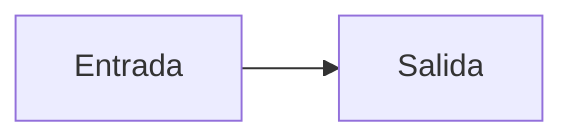

# Mapa funcional: Proyecto map-state-column

## Misión

Demostrar un proyecto conforme.

## Componentes

| Componente | Estado |
|---|---|
| Módulo ficticio | en-curso |

## Flujo

## Reglas de negocio no negociables

- Solo datos ficticios.

## Datos y fuentes

| Dato | Fuente |
|---|---|
| Ninguno | — |

## Integraciones

- Ninguna.
